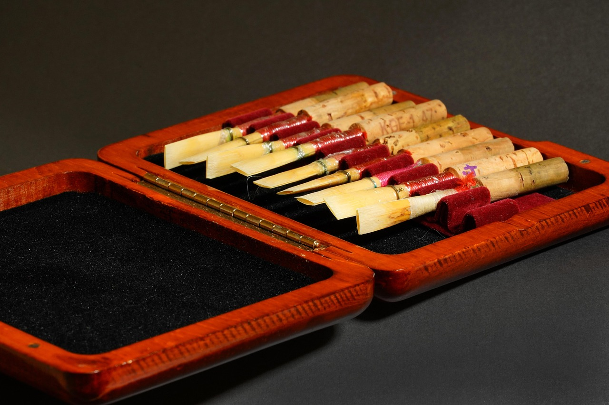
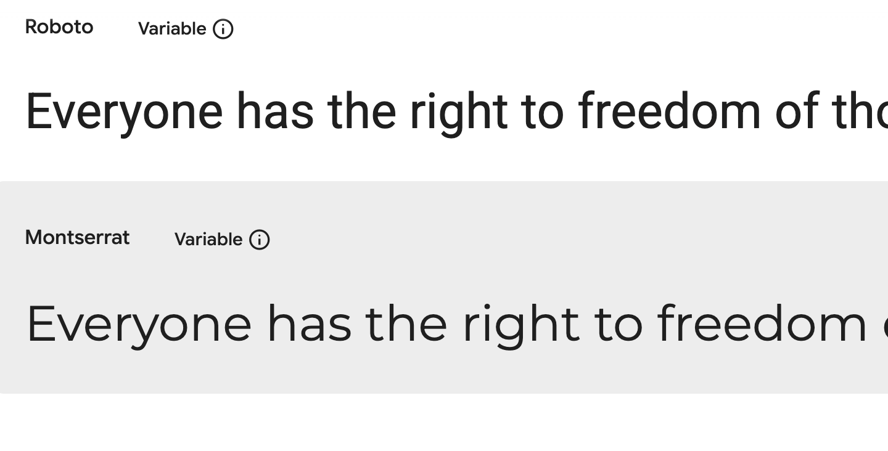
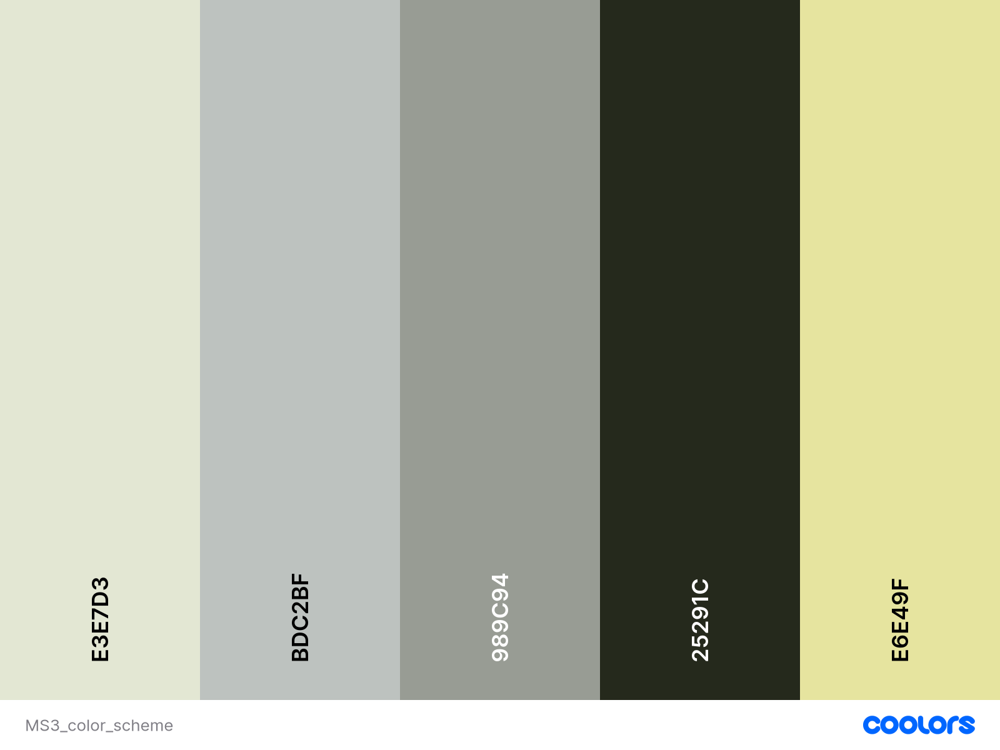
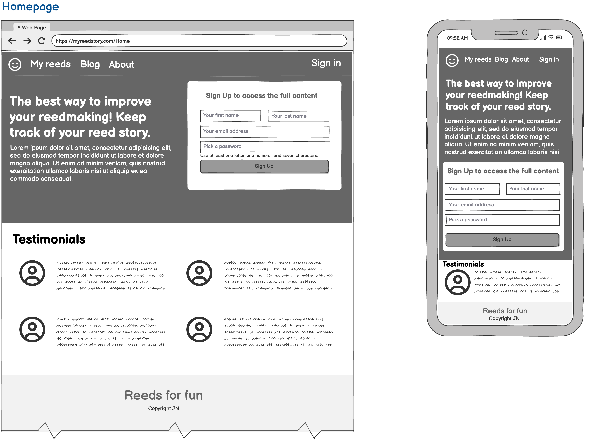
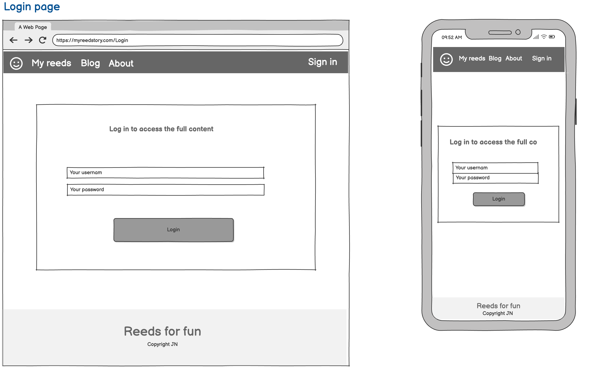
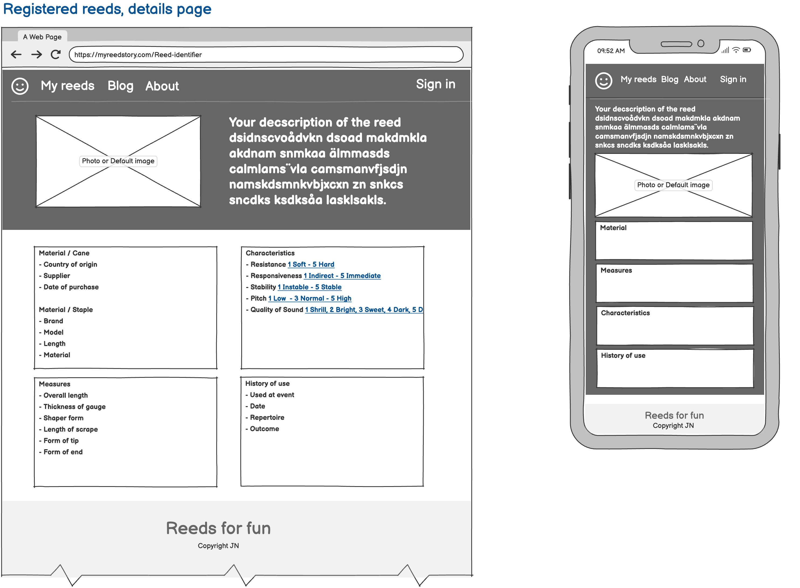
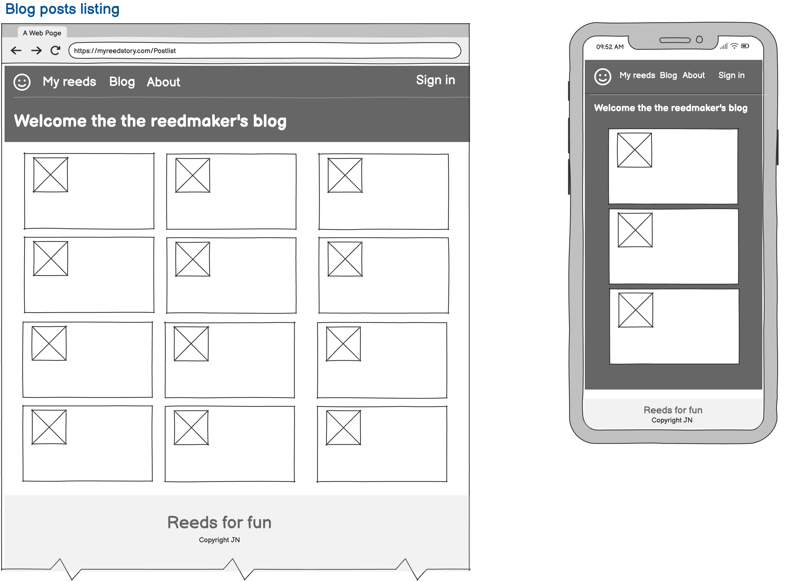

# Welcome to Reedmaker's blog

## Introduction
Musicians playing instruments with a reed spend a lot of time obsessing over which reed to play for the next concert. Players of Clarinet, Saxophone, Oboe and Basson all share a common challenge of finding a reed that will suite the accoustic, the repertoire, individual preferences and level of playing. Most players keep a number of reeds of different characteristics in order to have something available for every occasion, which means a number of reeds laying around in boxes and cases. 

| Double blade reeds | Single blade reeds |
| --------- | ---------|
| || 

A common challenge is to recall which reed has what characteristics and would be the perfect match for an upcoming concert or gig. 

**This is where this service comes in!**

Use this application to post a digital record of your reeds. Save data about your reed in physical measures, playing characteristics, when it was used and for what repertoire. "My reed story" will be there forever to help you learn from past experiences and to identify reed preferences. Use this application to post articles about the reedmaking process and comments about other musicians reeds and articles. 

Make progress as a reedmaker! Enjoy your reed story! 

## Value for a user
- **Keep a detailed ledger of your reeds**
  - Register data about your reeds and build a valuable source of information about your reedmaking, your preferences and use of reeds at different gigs. Organize your digital reeds and choose which ones to share with the community. 
- **Learn from your digital reedcase and be inspired by others'**
  - Analyse the collected information to reveal patterns and trends in your reedmaking. Use the ledger to recall moments of reed usage. Leverage your reedmaking skills by examining other reedmakers posts.    
- **Create and read interesting posts about reedmaking**
  - Reedmaking never stops fascinating the aspiring musician and proffessionals alike. Post or read an article and learn from the content and associated comments.  

# Contents
1. [Features](#features)
2. [User Experience (UX)](#user-experience)
3. [Information Architecture](#information-architecture)
4. [Technologies Used](#technologies-used)
5. [Agile Methodology](#agile-methodology)
6. [Deployment](#deployment)
7. [Testing](#testing)
8. [Known Issues and Future Features](#known-issues-and-future-features)
9. [Credits](#credits)

# Features
- Become a member, create a user account to access the full content
  
  A visitor on the website can access public information such as read access to the Reedmaking blog, public reed specifications and comments. A visitor can choose to become a community member by signing up for a user account. Signed in user can post data about reeds and to post comments on reeds and blog-posts. 

- Post data about one of your reeds
  
  A signed in user can post data about their reeds, such as material, measures, quality of sound and at which event it was played.
- Organize your registered reeds in categories - or "reed cases"
  
  A signed in user can organize posted reeds in categories, eg reeds for "chamber music", "symphony orchestra", "club gigs" or "practice".

- Filter and search for reeds based on keywords and characteristics
  
  A signed in user can search among posted reeds to recall what types of reeds have a sound quailty of "bright" or what reeds have been used for "jazz gigs". 

- Make a selection of your reeds public for others to see and comment
  
  A signed in user can chose wether to keep reed specifications to herself, or if to make them publically available for anyone to see. Other signed in users can post comments to public reed posts. 

- Post articles about reedmaking
  
  A signed in user can create an article about some aspect of Reedmaking. A user may have a reflection on the selection of cane or about a tool that may be of interest to others. 

- Comment on articles about reedmaking or published reeds
  
  A signed in user can post comments to articles about reedmaking or to reeds that another user has chosen to make public.

# User experience 
## Design choices, guiding principles
- **Recognition.** One common header and footer is applied for all pages across the site. 
- **Responsiveness.** The content is designed to be accessible equally well on a mobile client as on a full size screen.
- **Clarity.** Headlines, texts and organization shall be short and to the point, to guide and avoid overwhelming the user. 
- **Just enough.** information. In each view, there is enough information to maintain an overview to decide on the next action. Only in the detail-pages is the complete set of information shared. 

## Fonts
- The set of fonts was chosen for a modern and crisp look on the Website. Montserrat and Roboto are both appreciated as being clear and easy to read. Elegant yet professional.  
 

## Color schemes
- The colorscheme was selected with the basic color of cane and wood in mind. The slightly beige and yellow tones combined with some matching colors were chosen to give a clean yet stylish impression. 
 

## Wireframes
| Start page | Login form | 
| ---------  | ---------  |
| |  |

| Reeds list page | Reed detail page |
|  ---------------| ------------| 
|  |  |

| Post list page | Post detail page |
| -------------- | ---------------- |
|  |  |

# Information architecture
## Flowchart Webb

## Database design, ERD

# Technologies used
## Laguages and frameworks
- HTML
- CSS
- JavaScript
- Django
- Python
- Heroku
## Databases
- PostgresSQL
## Tools
### Coding
- Visual Studio Code for coding
- Git and GitHub for code versioning and project repo
- GitHub project for planning and user stories
### Design
- Lucidchart for the flowchart
- Balsamiq for the wireframes
- Coolors.com for the color scheme
- Font awesome for the set of fonts
- Favicon for icons 
- Pixabay for royalty free images
- Unsplash for royalty free images
### Test
- Am I Responsive
- Lighthouse
- HTML validator
- CSS validator
- JS validator
# Agile methodology
## Epics and user stories to plan the project
### Epic 1: Site administration
As an administrator of the site I need to manage user accounts, posts and comments, to ensure that the site is kept consistent, ethic and appreciated over time.\

**User stories**
- As an administrator I need to manage accounts, to help and support users in using the site
- As an administrator, I need to manage posts, to approve and perform CRUD activities to keep the site nice and tidy over time
- As an adminstrator I need to manage comments, to approve comments to ensure ethics, and alignment with intent.   

### Epic 2: Posting, organizing and searching among reeds
As a member of the service I want to post data about my reeds in a nicely structured, to help me find the specification I need for a future occasion.\

- **User stories**
  - As a member, I want to post data of my reeds, to keep a ledger over time
  - As a member, I want to select which of my reeds to make publicly visible, to get comments and recoginition from the reeds of my choice
  - As a member, I want to search and filter out sections of my posted reeds, based on keywords and reed characteristics, to get inspiration for the making of new reeds and to learn about my preferences
  - As a member, I want to organize my reeds in categories, to help me sort the reeds over time  

### Epic 3: Posting articles on reedmaking
As a member of the site I want to share my thoughts and reflections on aspects of the reedmaking process, to inspire and be inspired by other reedmakers and musicians.\

- **User stories**
  - As a member, I want to share insights and knowledge from the reedmaking process, to inspire other musicians and to learn from others.

### Epic 4: Reading and commenting on reeds and articles
As a visitor of the site, I want to take part of published content, and to post comments on published content, to contribute to the shared knowledge and to show appreciation.\

- **User stories**
  - As a visitor, I want to post comments to posted articles, to show appreciation and contribution
  - As a vistor, I want to post comments to posted reed specifications, to show appreciation and contribution

## Kanban to visualize and follow progress
 

# Testing
- TBD
- Manual and Automated testing
- Results and evidence
# Deploy
- TBD - deploying to Herouku
# Known issues and Future features
- TBD - From testing and restlist
# Credits
- TBD - CI, Mentor, Channels 
