# Welcome to Reedmaker Studio

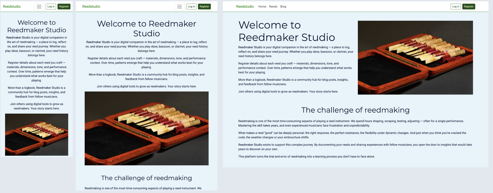

👉 [Try the live app](https://reedmakersblog-cde264c272bc.herokuapp.com/)

## Introduction

For reed players — oboists, bassoonists, clarinetists, saxophonists — the quest for the perfect reed never ends. Each rehearsal, venue, or piece calls for something slightly different. We craft, tweak, and rotate reeds constantly. But too often, those hard-earned insights get lost in a drawer.

| Cane               | Single blade reeds |
| ------------------ | ------------------ |
| 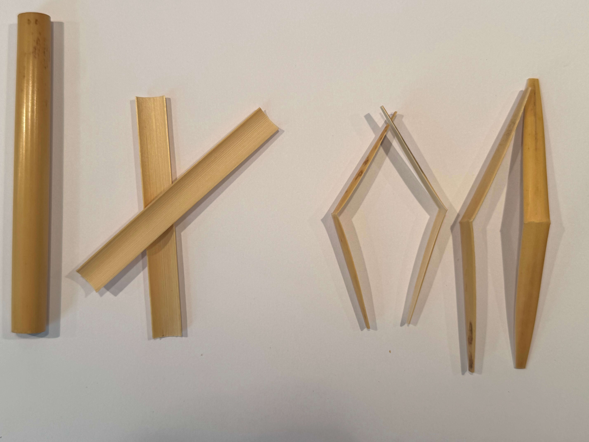 |  |

🎯 **The challenge:** How do we learn from our own reedmaking — and each other's?

---

## Enter Reedmaker Studio

Reedmaker Studio is a shared space for documenting, reflecting on, and discussing reedmaking. 

- **Log your reeds** with cane source, dimensions, tone, usage, and repertoire.
- **Connect with others** by commenting and exchanging experiences.
- **Publish posts** about your methods, findings, or frustrations.
- **Discover trends** in your reeds — and in the community.

Reedmaker Studio is built for musicians who want to go beyond trial-and-error, together.

**Document your work. Share your journey. Learn with others.**

# Contents
1. [Purpose and goals](#Purpose)
2. [Features](#Features)
3. [User experience (UX)](#user-experience)
4. [Information architecture](#information-architecture)
5. [Technologies used](#technologies)
6. [Agile project management](#agile)
7. [Deployment](#deployment)
7. [Testing](#testing)
9. [Known Issues and Future Features](#known-issues-and-future-features)
10. [Credits](#credits)

# Purpose and goals
## App owner goals

- **Accelerate reedmaking skills among musicians**  
  Provide tools that help players learn faster by documenting, comparing, and reflecting on their reeds.

- **Build a dedicated community**  
  Attract reed players (oboists, bassoonists, clarinetists) to share experiences and support each other.

- **Enable knowledge sharing**  
  Make it easy to publish blog posts and comments, so practical insights spread within the community.

- **Lay the groundwork for targeted resources**  
  Create a user base that can benefit from future materials like tutorials, guides, or curated content tailored to reedmakers.

## User goals

- **Document reeds with precision**  
  Keep a searchable archive of each reed’s build, feel, and use in performance.

- **Identify patterns and preferences**  
  Spot trends over time to improve material choice, shaping, and scraping technique.

- **Engage with fellow reedmakers**  
  Share insights through blog posts and comments. Learn from others’ successes and struggles.

- **Improve musical consistency**  
  Use your reed history to support better playing, rehearsal prep, and concert readiness.

# Features
- Become a member, create a user account to access the full content
  
  A visitor on the website can access public information such as read access to the Reedmaking blog, public reed specifications and comments. A visitor can choose to become a community member by signing up for a user account. Signed in user can post data about reeds and to post comments on reeds and blog-posts. 

  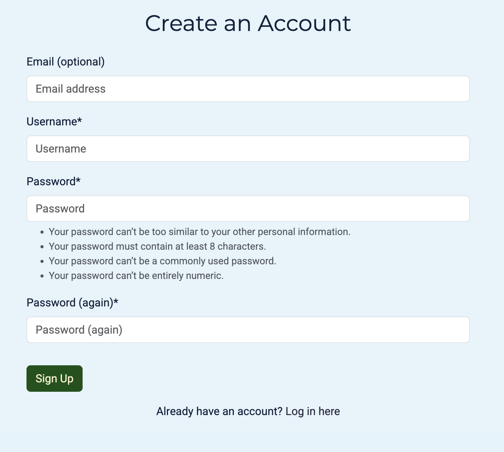

- Post data about one of your reeds
  
  A signed in user can post data about their reeds, such as material, measures, quality of sound and at which event it was played.

  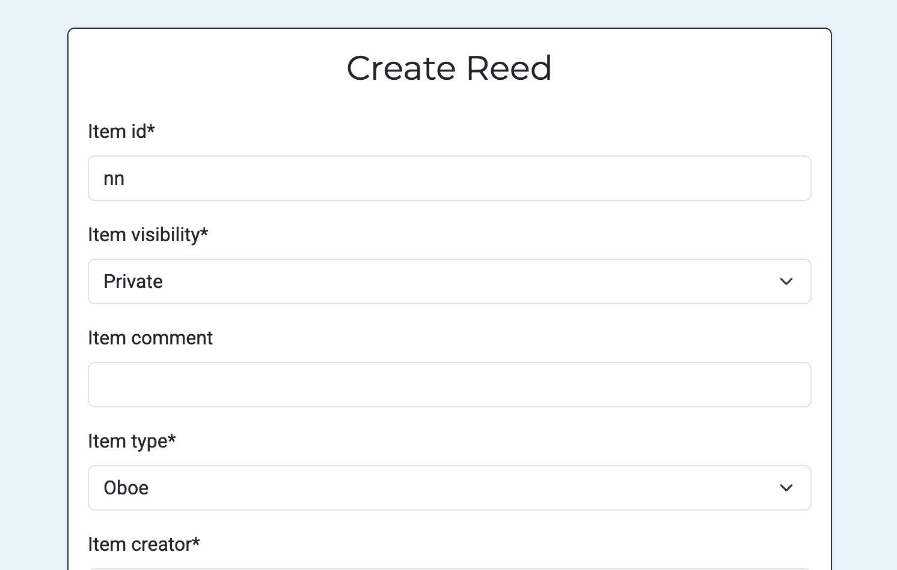

- Filter and search for reeds based on keywords and characteristics
  
  A signed in user can search among posted reeds to recall what types of reeds have a sound quailty of "bright" or what reeds have been used for "jazz gigs". 

  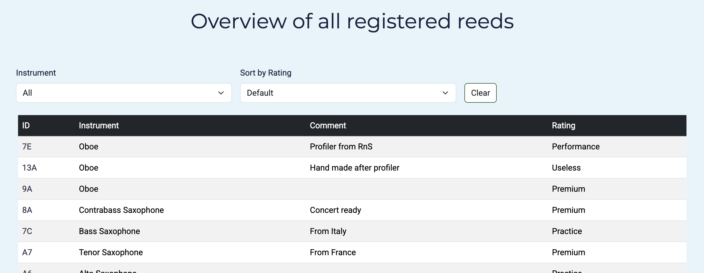

- Post articles about reedmaking
  
  A signed in user can create an article about some aspect of Reedmaking. A user may have a reflection on the selection of cane or about a tool that may be of interest to others. 

    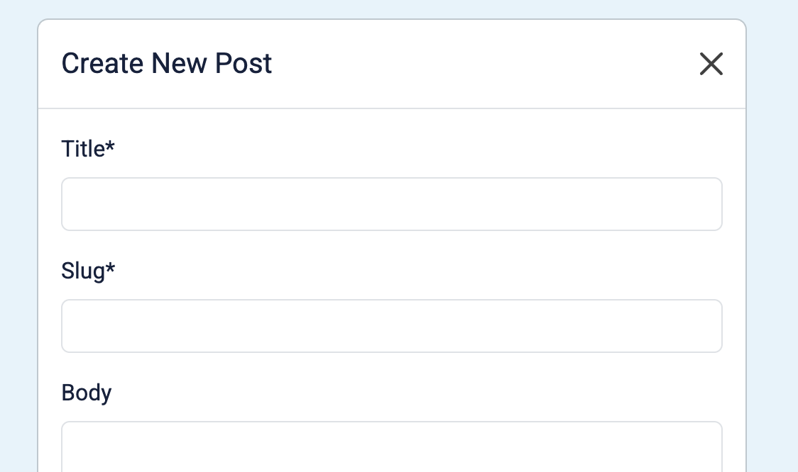

- Comment on articles about reedmaking or published reeds
  
  A signed in user can post comments to articles about reedmaking or to reeds that another user has chosen to make public.
  
  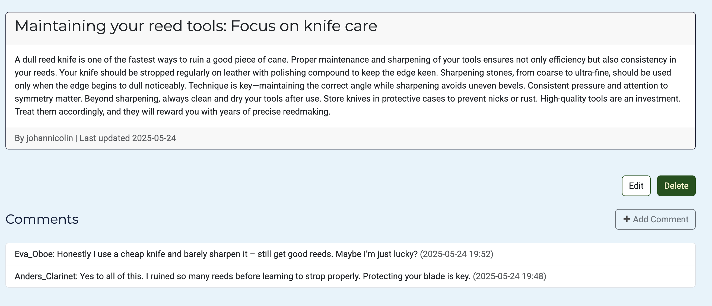

# User experience 
## Design choices, guiding principles
- **Recognition.** One common header and footer is applied for all pages across the site. 
- **Responsiveness.** The content is designed to be accessible equally well on a mobile client as on a full size screen.
- **Clarity.** Headlines, texts and organization shall be short and to the point, to guide and avoid overwhelming the user. 
- **Just enough.** information. In each view, there is enough information to maintain an overview to decide on the next action. Only in the detail-pages is the complete set of information shared. 

## Fonts
- The set of fonts was chosen for a modern and crisp look on the Website. Montserrat and Roboto are both appreciated as being clear and easy to read. Elegant yet professional.  


## Color schemes
- The colorscheme was selected for a clear and clean look.<br> 
 

## Wireframes
| Start page | Login form | 
| ---------  | ---------  |
|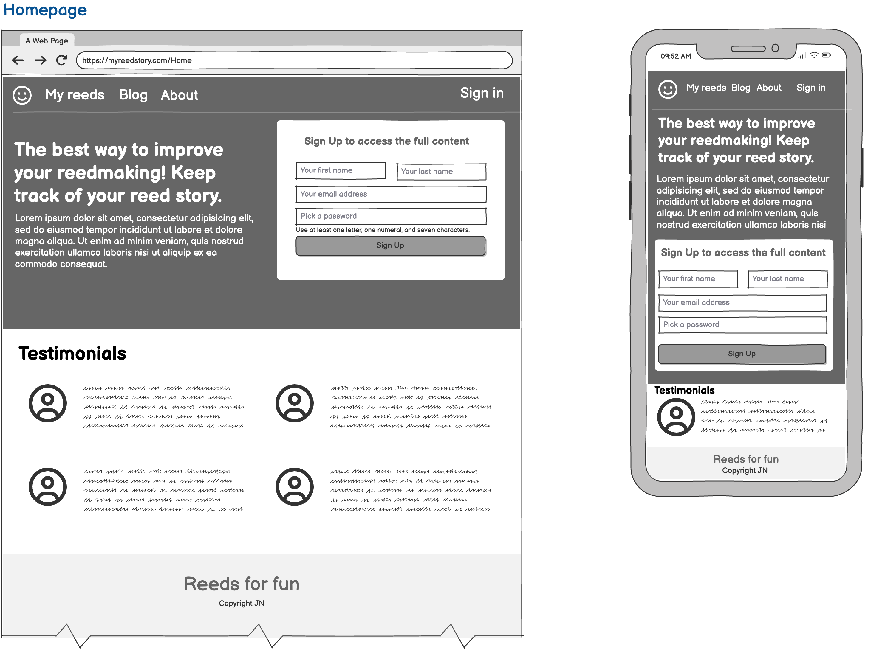 |  |

| Reeds list page | Reed detail page |
|  ---------------| ------------| 
| 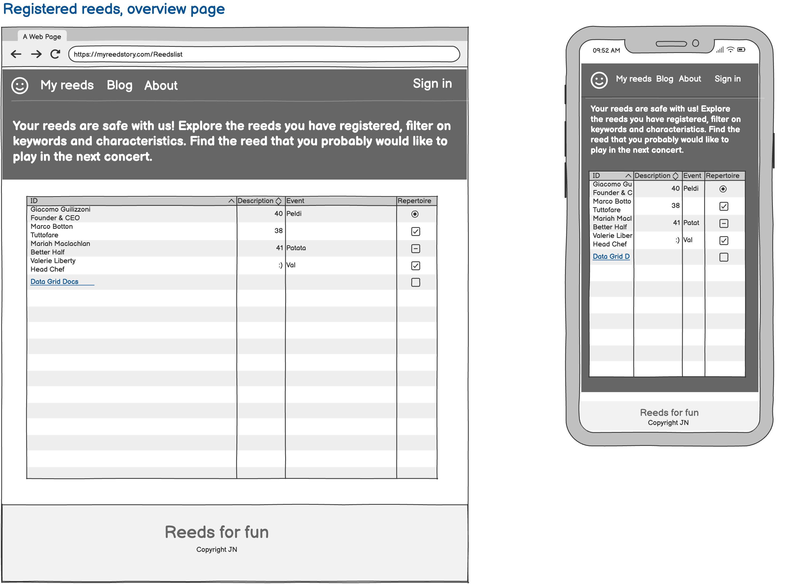 | 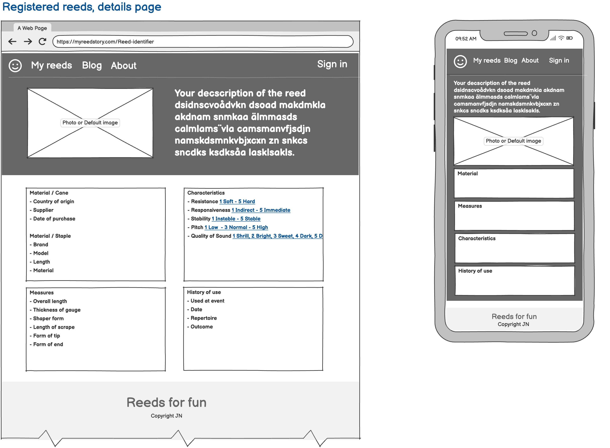 |

| Post list page | Post detail page |
| -------------- | ---------------- |
|  | 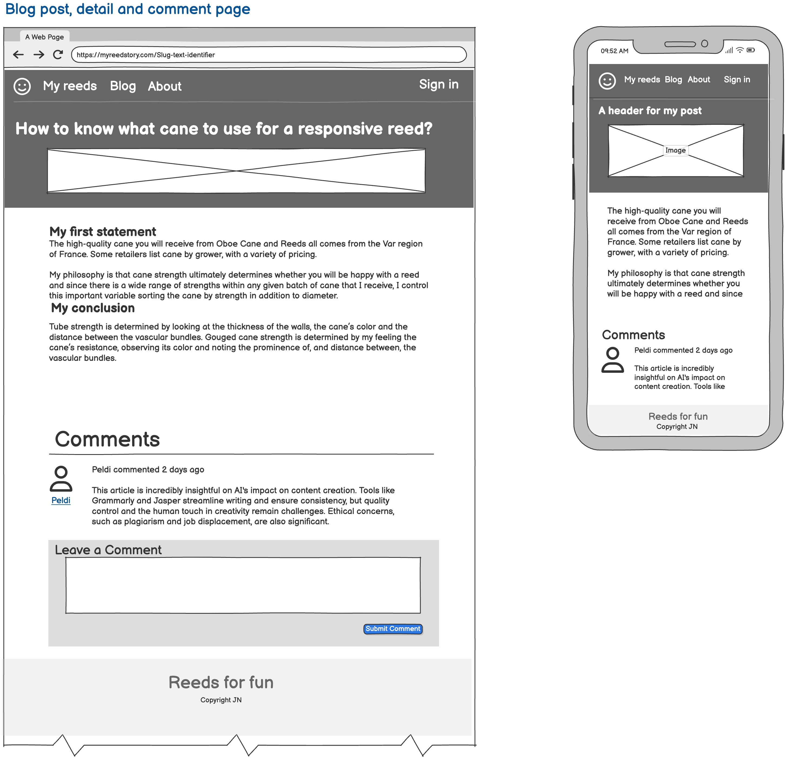 |

# Information architecture
## Flowchart Webb


## Database design, ERD
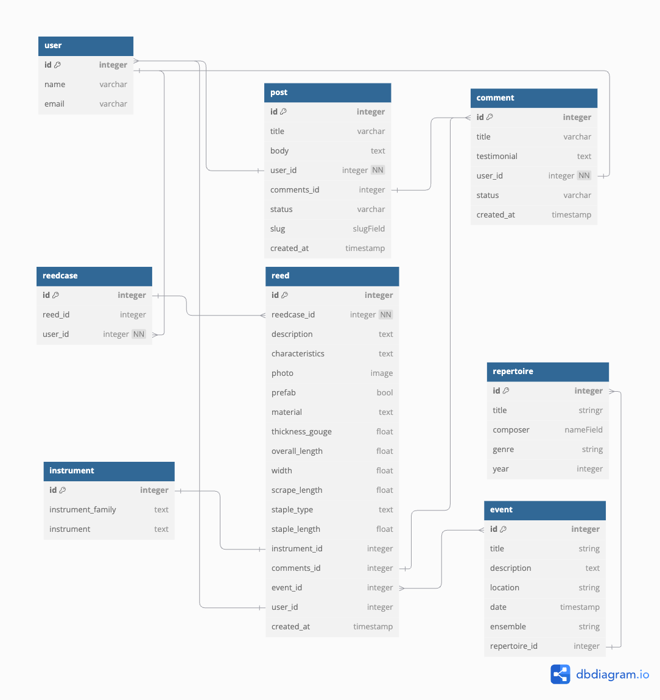

# Technologies used
## Laguages and frameworks
- [HTML](https://www.w3schools.com/html/default.asp)
- [CSS](https://www.w3schools.com/css/default.asp) 
- [JavaScript](https://www.w3schools.com/JSREF/jsref_reference.asp)
- [Python](https://www.w3schools.com/python/default.asp)
- [Django](https://docs.djangoproject.com/en/5.2/)
- [Heroku](https://www.heroku.com/)
## Databases
- [PostgresSQL](https://www.postgresql.org/download/)
## Tools
### Coding
- [Visual Studio Code](https://code.visualstudio.com/) IDE
- Git and [GitHub](https://github.com/)
- GitHub project for planning and user stories
### Design
- [Lucidchart](https://www.lucidchart.com/pages) for the flowchart
- [Balsamiq](https://balsamiq.com/) for the wireframes
- [dbdiagram](https://dbdiagram.io/home)  for ERD
- [Coolors](https://coolors.co/) for the color scheme
- [Font awesome](https://fontawesome.com/) for the set of fonts
- [Pixabay](https://pixabay.com/) and [Unsplash](https://unsplash.com/) for royalty free images
- [Tinypng](https://tinypng.com/) to compress photos and images
### Test
- [Responsively App](https://responsively.app/) for testing responsiveness
- Chrome Lighthouse
- [W3 HTML validator](https://validator.w3.org/) 
- [W3 CSS validator](https://jigsaw.w3.org/css-validator/)
- [PEPCI8 Linter from Code Institute](https://pep8ci.herokuapp.com/#)
# Agile methodology
## Project planning with Epics & Tasks

The project is organized according to agile concepts with Epics grouping related Tasks. This is an overview of tasks performed to complete this project.

### Epic: Environment configuration
- [x] [Install packages and dependencies](https://github.com/JNicolin/MS3-ReedmakerStudio/issues/10)
- [x] [Create Django project with apps: reeds, posts, comments](https://github.com/JNicolin/MS3-ReedmakerStudio/issues/15)
- [x] [Prepare dev and prod databases and deploys](https://github.com/JNicolin/MS3-ReedmakerStudio/issues/8)

### Epic: User Authentication and Accounts
- [x] [Create user login, logout and register with django-allauth](https://github.com/JNicolin/MS3-ReedmakerStudio/issues/23)
- [x] [Register New Users](https://github.com/JNicolin/MS3-ReedmakerStudio/issues/23)
- [x] [Style Allauth forms with Bootstrap](https://github.com/JNicolin/MS3-ReedmakerStudio/issues/14)

### Epic: Reed management
- [x] [Implement Reed model & forms](https://github.com/JNicolin/MS3-ReedmakerStudio/issues/7)
- [x] [Implement CRUD views for Reed, with logged-in logic](https://github.com/JNicolin/MS3-ReedmakerStudio/issues/28)
- [x] [Create event, repertoire and instrument model & forms](https://github.com/JNicolin/MS3-ReedmakerStudio/issues/29)
- [x] [Reed listview with filtering and sorting](https://github.com/JNicolin/MS3-ReedmakerStudio/issues/2)
- [x] [Reed detail view with comments, events, repertoire](https://github.com/JNicolin/MS3-ReedmakerStudio/issues/8)
- [x] [Add filering on instrument and rating in list view](https://github.com/JNicolin/MS3-ReedmakerStudio/issues/26)
- [x] [JavaScript to auto-submit filter form on change](https://github.com/JNicolin/MS3-ReedmakerStudio/issues/38)
- [x] [Use modals to add events and repertoire from reed detail view ](https://github.com/JNicolin/MS3-ReedmakerStudio/issues/30)
- [x] [Limit Edit/Delete to owner only](https://github.com/JNicolin/MS3-ReedmakerStudio/issues/10)

### Epic: Blogging
- [x] [Implement post model & forms](https://github.com/JNicolin/MS3-ReedmakerStudio/issues/18)
- [x] [Implement CRUD views for Post, with logged-in logic](https://github.com/JNicolin/MS3-ReedmakerStudio/issues/28)
- [x] [Use modal to add posts from Post detail view](https://github.com/JNicolin/MS3-ReedmakerStudio/issues/32)
- [x] [Implement responsive cards for Posts](https://github.com/JNicolin/MS3-ReedmakerStudio/issues/6)

### Epic: Reusable comments for reeds and posts
- [x] [Implement Comment model & forms](https://github.com/JNicolin/MS3-ReedmakerStudio/issues/18)
- [x] [Connect Comment model generically to both Post and Reed](https://github.com/JNicolin/MS3-ReedmakerStudio/issues/19)
- [x] [Create CRUD views for Comments, with logged in logic](https://github.com/JNicolin/MS3-ReedmakerStudio/issues/17)

### Epic: UI and Styling
- [x] [Design `base.html` with Bootstrap layout](https://github.com/JNicolin/MS3-ReedmakerStudio/issues/20)
- [x] [Design modular '_component.html' with Bootstrap layout](https://github.com/JNicolin/MS3-ReedmakerStudio/issues/21)
- [x] [Ensure responsive Navbar with login/logout/register buttons](https://github.com/JNicolin/MS3-ReedmakerStudio/issues/34)
- [x] [Footer stays at bottom](https://github.com/JNicolin/MS3-ReedmakerStudio/issues/36)
- [x] [Add consistent color scheme with custom CSS](https://github.com/JNicolin/MS3-ReedmakerStudio/issues/31)
- [x] [Create custom buttons with Bootstrap layout](https://github.com/JNicolin/MS3-ReedmakerStudio/issues/24)
- [x] [Ensure responsiveness for all key templates](https://github.com/JNicolin/MS3-ReedmakerStudio/issues/35)
- [x] [Add crispy-forms for all forms](https://github.com/JNicolin/MS3-ReedmakerStudio/issues/22)

### Epic: Administration panel
- [x] [Register models with Django administration](https://github.com/JNicolin/MS3-ReedmakerStudio/issues/9)
- [x] [Ensure all administration tasks are accessible as superuser](https://github.com/JNicolin/MS3-ReedmakerStudio/issues/5)

### Epic: Testing and Deployment
- [x] [Manual testing for responsiveness](https://github.com/JNicolin/MS3-ReedmakerStudio/issues/23)
- [x] [Write tests for Reeds and Posts](https://github.com/JNicolin/MS3-ReedmakerStudio/issues/24)
- [x] [Deploy to Heroku](https://github.com/JNicolin/MS3-ReedmakerStudio/issues/39)
- [x] [Validate code, CSS, HTML](https://github.com/JNicolin/MS3-ReedmakerStudio/issues/3)
- [x] [Create content for testing, to validate user experience](https://github.com/JNicolin/MS3-ReedmakerStudio/issues/4)

---

🔗 All opened and closed issues for this project can be found here: [Issue Tracker](https://github.com/JNicolin/MS3-ReedmakerStudio/issues)

## Kanban to visualize and follow progress
### Project Board

This board allows to the development progress in the [GitHub Project Board](https://github.com/users/JNicolin/projects/8)

[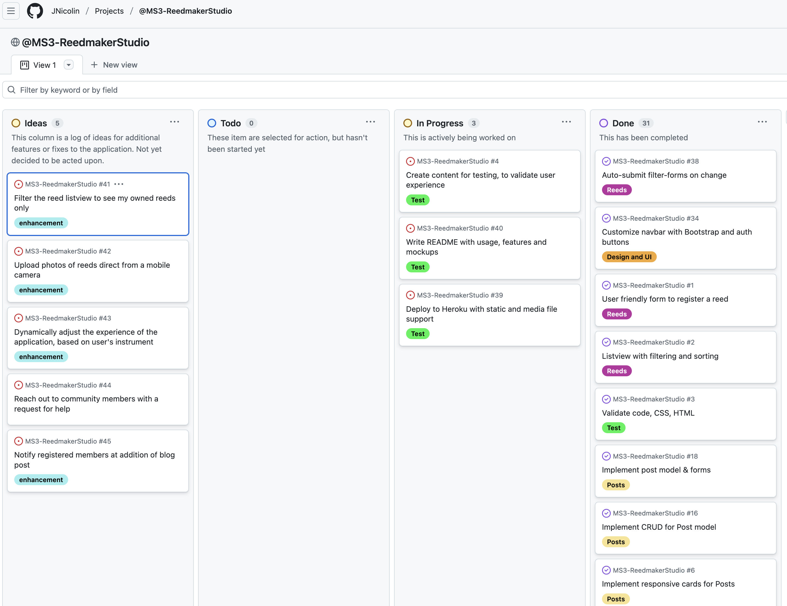](https://github.com/users/JNicolin/projects/8) 

# Testing
## Functional testing
### Functional test cases
Below is a list of test cases covering the key functionality of the application, used to verify that key features are working as expected

| ID   | Epic/Feature            | Test description                                               | Expected outcome                                          | Actual outcome |
|------|---------------------|----------------------------------------------------------------|-----------------------------------------------------------|----------------|
| TC01 | User authentication | User can register with email and password                      | User account is created and redirected to homepage        |Pass            |
| TC02 | User authentication | User can log in with valid credentials                         | User is authenticated and redirected to homepage          |Pass            |
| TC03 | User access control | Unauthenticated user cannot access create/update/delete views  | Redirects to login page                                   |Pass            |
| TC04 | Blogging            | Logged-in user can create a new post                           | Post appears on blog list                                 |Pass            |
| TC05 | Blogging            | Only author sees edit/delete buttons on their own post         | Buttons are visible to author only                        |Pass            |
| TC06 | Blogging            | Post list displays title, author, and excerpt                  | Correct summary is shown in cards                         |Pass            |
| TC07 | Blogging            | Detailed post view correctly linked from listview              | Correct post detail opens in the detail page              |Pass            |
| TC08 | Reeds management    | Logged-in user can add new reed                                | Reed appears in list and detail view                      |Pass            |
| TC09 | Reeds management    | Logged-in user can add an Event                                | The new Event shows on the Reed detail view               |Pass            |
| TC10 | Reeds management    | Logged-in user can add a Repertoire                            | The new Repertoire shows on the Reed detail view          |Pass            |
| TC11 | Reeds management    | Reed list is filterable by instrument                          | Filter narrows down list correctly                        |Pass            |
| TC12 | Reeds management    | Reed list can be sorted on rating                              | Order is reflecting sorting order                         |Pass            |
| TC13 | Reeds management    | Reed list is automatically adjusted on change in filter/sort   | List view adjust on change in sorting or filter form      |Pass            |
| TC14 | Reeds management    | Detailed reed view correctly linked from listview              | Correct reed detail opens in the detail page              |Pass            |
| TC15 | Reeds management    | Reed detail shows correct material, characteristics, etc.      | All details rendered properly                             |Pass            |
| TC16 | Commenting          | Logged-in user can comment on a Reed                           | Comment appears under correct reed                        |Pass            |
| TC17 | Commenting          | Logged-in user can comment on a blog Post                      | Comment appears under correct blogpost                    |Pass            |
| TC18 | Commenting          | Comments modal triggers from detail Reed view                  | Modal opens with form                                     |Pass            |
| TC19 | Commenting          | Comments modal triggers from detail Post view                  | Modal opens with form                                     |Pass            |
| TC20 | Commenting          | Anonymous users cannot post comments                           | Redirected to login or see disabled button                |Pass            |

## Static validation of code
### CSS, HTML and JavaScript validation
 - All CSS was validated in the W3 group validator: No remaining comments or errors
 - All HTML vwas validate in W3 group validator: The HTML validator does not like DTL tags. It does give warnings for this. These are the only remaining.
 - The JavaScript was run through the CI Linter app: No remaining errors

## Testing for responsiveness
- Cross-browser testing was done to validate the responsiveness of the application accross different screensizes and positions. Chrome Inspect and the dedicated ResponsivelyApp were used. 

There are no known remaining issues from this testing.

## Automated testing
- The application was tested using Chrome Lighthouse for Good practices, Performance and Accessibility.
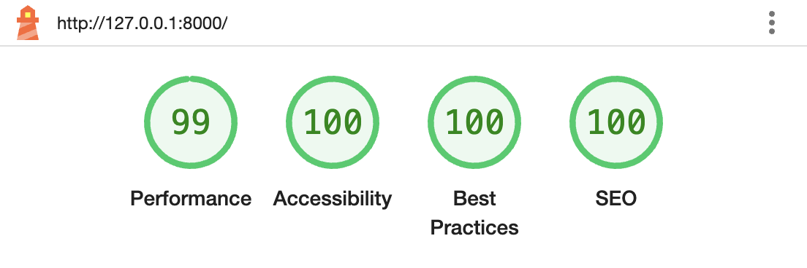


## Test of deploy to production environment in Heruko
###
Steps to deploy this application to heruko
  1. **Sign in to Heroku**
  2. **Connect to repository on GitHub** <br>
Under the Deploy tab, find Deployment method → GitHub and search the correct repo (.../MS3-ReedmakerStudio).

  3. **ReedStudio expects these config variables**<br>
Go to the Settings tab → Reveal Config Vars, and add:
    ```
    DATABASE_URL='your PostgreSQL db url'
    DISABLE_COLLECTSTATIC=0
    DJANGO_ENV=production # ensures correct settings file is used
    SECRET_KEY='a secret key of your choice'
    ```
  4. **Push manual deploy from main branch** 

    Result: Deploy works with no errors:<br><br> 
    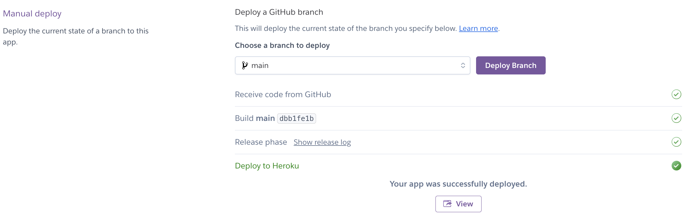

# Known issues and Future features
## Known issues
- Functional testing has been performed along the development. A number of discoveries were made among which all revealed errors have been corrected in the deployed version.
- There are no remaining errors or bugs, with the exception of the mentioned warnings from the HTML validator on Django Template Language tags.
- I have spent quite some time on figuring out how to build a modular way of commenting. As I wanted to implement commenting feature for Reeds as well as for Blogposts, I wanted to learn how to develop this once and use it twice. I came to learn about the generic views from the Django framework, and that was the way to do it!

## Future features
###
I keep a list of feature cards in my [GitHub Project Board](https://github.com/users/JNicolin/projects/8). Future features are labelled as **Enhancement** in the board. Below is an extract of Ideas at the time of writing this text:
- [Filter the reed listview to see my owned reeds only](https://github.com/JNicolin/MS3-ReedmakerStudio/issues/41)
- [Upload photos of reeds direct from a mobile camera](https://github.com/JNicolin/MS3-ReedmakerStudio/issues/42)
- [Dynamically adjust the experience of the application, based on the user's type of instrumenty](https://github.com/JNicolin/MS3-ReedmakerStudio/issues/43)
- [Reach out to community members with a request for help](https://github.com/JNicolin/MS3-ReedmakerStudio/issues/44)
- [Send notices to registered members at addition of blog posts](https://github.com/JNicolin/MS3-ReedmakerStudio/issues/45)

### Are you a developer? Then I invite you to Fork the repository to contribute
You can contribute to the enhancement and continued development of this project. This guide will help you get started:

1. **Fork this repo on [GitHub-ReedmakerStudio](https://github.com/JNicolin/MS3-ReedmakerStudio)**
2. **Clone the forked repo**:
    ```bash
    git clone https://github.com/your-username/MS3-ReedmakerStudio.git
    cd MS3-ReedmakerStudio
    ```
3. **Make sure that Python 3.12.x is installed**
    ```bash
    python --version
    ``` 
4. Create and activate a virtual environment
    ```bash
    python3 -m venv .venv
    source .venv/bin/activate
    ``` 
5. **Install dependencies**
    ```bash
    pip install -r requirements.txt
    ``` 
6. **Add a .env file with a secret key in the root folder**
    ```bash
    SECRET_KEY="your secret :-)"
    ```
7. **Start the development server to validate set-up**
    ```bash
    python3 manage.py runserver
    ```
8. **Create pull requests to suggest your changes**
    ```
    Thank you!!!!
    ```
# Credits

There are so many fantastic people, teams and forums available to help in the developer's community! I want to extend a sincere thank you to the follwing stars in particular:
- The Code Institute team with a very useful LMS and good advice
- Kay @Kay_ci from Code Institute for keeping up contact and pushing me onwards
- My mentor Simon @Eventyret_mentor for spot on remarks, 100% professional yet very humble approach
- My new Youtube hero @DaveGrayTeachesCode with Django courses and material
