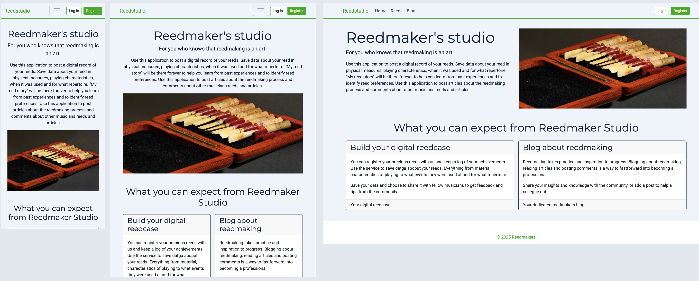

# Welcome to Reedmaker's Studio



## Introduction
Musicians playing instruments with a reed spend a lot of time obsessing over which reed to play for the next concert. Players of Clarinet, Saxophone, Oboe and Basson all share a common challenge of finding a reed that will suite the accoustic, the repertoire, individual preferences and level of playing. Most players keep a number of reeds of different characteristics in order to have something available for every occasion, which means a number of reeds laying around in boxes and cases. 

| Double blade reeds | Single blade reeds |
| --------- | ---------|
| || 

A common challenge is to recall which reed has what characteristics and would be the perfect match for an upcoming concert or gig. 

**This is where this service comes in!**

Use this application to post a digital record of your reeds. Save data about your reed in physical measures, playing characteristics, when it was used and for what repertoire. "My reed story" will be there forever to help you learn from past experiences and to identify reed preferences. Use this application to post articles about the reedmaking process and comments about other musicians reeds and articles. 

Make progress as a reedmaker! Enjoy your reed story! 

## Value for a user
- **Keep a detailed ledger of your reeds**
  - Register data about your reeds and build a valuable source of information about your reedmaking, your preferences and use of reeds at different gigs. Organize your digital reeds and choose which ones to share with the community. 
- **Learn from your digital reedcase and be inspired by others'**
  - Analyse the collected information to reveal patterns and trends in your reedmaking. Use the ledger to recall moments of reed usage. Leverage your reedmaking skills by examining other reedmakers posts.    
- **Create and read interesting posts about reedmaking**
  - Reedmaking never stops fascinating the aspiring musician and proffessionals alike. Post or read an article and learn from the content and associated comments.  

# Contents
1. [Features](#features)
2. [User Experience (UX)](#user-experience)
3. [Information Architecture](#information-architecture)
4. [Technologies Used](#technologies-used)
5. [Agile Methodology](#agile-methodology)
6. [Deployment](#deployment)
7. [Testing](#testing)
8. [Known Issues and Future Features](#known-issues-and-future-features)
9. [Credits](#credits)

# Features
- Become a member, create a user account to access the full content
  
  A visitor on the website can access public information such as read access to the Reedmaking blog, public reed specifications and comments. A visitor can choose to become a community member by signing up for a user account. Signed in user can post data about reeds and to post comments on reeds and blog-posts. 

- Post data about one of your reeds
  
  A signed in user can post data about their reeds, such as material, measures, quality of sound and at which event it was played.
- Organize your registered reeds in categories - or "reed cases"
  
  A signed in user can organize posted reeds in categories, eg reeds for "chamber music", "symphony orchestra", "club gigs" or "practice".

- Filter and search for reeds based on keywords and characteristics
  
  A signed in user can search among posted reeds to recall what types of reeds have a sound quailty of "bright" or what reeds have been used for "jazz gigs". 

- Make a selection of your reeds public for others to see and comment
  
  A signed in user can chose wether to keep reed specifications to herself, or if to make them publically available for anyone to see. Other signed in users can post comments to public reed posts. 

- Post articles about reedmaking
  
  A signed in user can create an article about some aspect of Reedmaking. A user may have a reflection on the selection of cane or about a tool that may be of interest to others. 

- Comment on articles about reedmaking or published reeds
  
  A signed in user can post comments to articles about reedmaking or to reeds that another user has chosen to make public.

# User experience 
## Design choices, guiding principles
- **Recognition.** One common header and footer is applied for all pages across the site. 
- **Responsiveness.** The content is designed to be accessible equally well on a mobile client as on a full size screen.
- **Clarity.** Headlines, texts and organization shall be short and to the point, to guide and avoid overwhelming the user. 
- **Just enough.** information. In each view, there is enough information to maintain an overview to decide on the next action. Only in the detail-pages is the complete set of information shared. 

## Fonts
- The set of fonts was chosen for a modern and crisp look on the Website. Montserrat and Roboto are both appreciated as being clear and easy to read. Elegant yet professional.  
 

## Color schemes
- The colorscheme was selected with the basic color of cane and wood in mind. The slightly beige and yellow tones combined with some matching colors were chosen to give a clean yet stylish impression. 
 

## Wireframes
| Start page | Login form | 
| ---------  | ---------  |
| |  |

| Reeds list page | Reed detail page |
|  ---------------| ------------| 
|  |  |

| Post list page | Post detail page |
| -------------- | ---------------- |
|  |  |

# Information architecture
## Flowchart Webb


## Database design, ERD


# Technologies used
## Laguages and frameworks
- [HTML](https://www.w3schools.com/html/default.asp)
- [CSS](https://www.w3schools.com/css/default.asp) 
- [JavaScript](https://www.w3schools.com/JSREF/jsref_reference.asp)
- [Python](https://www.w3schools.com/python/default.asp)
- [Django](https://docs.djangoproject.com/en/5.2/)
- [Heroku](https://www.heroku.com/)
## Databases
- [PostgresSQL](https://www.postgresql.org/download/)
## Tools
### Coding
- [Visual Studio Code](https://code.visualstudio.com/) IDE
- Git and [GitHub](https://github.com/)
- GitHub project for planning and user stories
### Design
- [Lucidchart](https://www.lucidchart.com/pages) for the flowchart
- [Balsamiq](https://balsamiq.com/) for the wireframes
- [dbdiagram](https://dbdiagram.io/home)  for ERD
- [Coolors](https://coolors.co/) for the color scheme
- [Font awesome](https://fontawesome.com/) for the set of fonts
- [Pixabay](https://pixabay.com/) and [Unsplash](https://unsplash.com/) for royalty free images
### Test
- [Responsively App](https://responsively.app/) for testing responsiveness
- Chrome Lighthouse
- [W3 HTML validator](https://validator.w3.org/) 
- [W3 CSS validator](https://jigsaw.w3.org/css-validator/)
- [PEPCI8 Linter from Code Institute](https://pep8ci.herokuapp.com/#)
# Agile methodology
## 🗂️ Epics & Tasks

The project is organized according to agile concepts with Epics grouping related Tasks. This is an overview of tasks performed to complete this project.

### 🛫 Epic: Initiate environment
- [ ] [Install packages and dependencies](https://github.com/JNicolin/MS3-ReedmakerStudio/issues/10)
- [ ] [Create Django project with apps: reeds, posts, comments](https://github.com/JNicolin/MS3-ReedmakerStudio/issues/15)
- [ ] [Prepare dev and prod databases and deploys](https://github.com/JNicolin/MS3-ReedmakerStudio/issues/8)

### 👥 Epic: User Authentication & Accounts
- [x] [Create user login, logout and register with django-allauth](https://github.com/JNicolin/MS3-ReedmakerStudio/issues/23)
- [x] [Register New Users](https://github.com/JNicolin/MS3-ReedmakerStudio/issues/23)
- [x] [Style Allauth forms with Bootstrap](https://github.com/JNicolin/MS3-ReedmakerStudio/issues/14)

### 🎼 Epic: Reed Management
- [ ] [Implement Reed model & forms](https://github.com/JNicolin/MS3-ReedmakerStudio/issues/7)
- [x] [Implement CRUD views for Reed, with logged-in logic](https://github.com/JNicolin/MS3-ReedmakerStudio/issues/28)
- [ ] [Create event, repertoire and instrument model & forms](https://github.com/JNicolin/MS3-ReedmakerStudio/issues/29)
- [ ] [Reed listview with filtering and sorting](https://github.com/JNicolin/MS3-ReedmakerStudio/issues/2)
- [ ] [Reed detail view with comments, events, repertoire](https://github.com/JNicolin/MS3-ReedmakerStudio/issues/8)
- [ ] [Add filering on instrument and rating in list view](https://github.com/JNicolin/MS3-ReedmakerStudio/issues/26)
- [ ] [JavaScript to auto-submit filter form on change](https://github.com/JNicolin/MS3-ReedmakerStudio/issues/38)
- [ ] [Use modals to add events and repertoire from reed detail view ](https://github.com/JNicolin/MS3-ReedmakerStudio/issues/30)
- [ ] [Limit Edit/Delete to owner only](https://github.com/JNicolin/MS3-ReedmakerStudio/issues/10)

### 📰 Epic: Blog Posts
- [x] [Implement post model & forms](https://github.com/JNicolin/MS3-ReedmakerStudio/issues/18)
- [x] [Implement CRUD views for Post, with logged-in logic](https://github.com/JNicolin/MS3-ReedmakerStudio/issues/28)
- [ ] [Use modal to add posts from Post detail view](https://github.com/JNicolin/MS3-ReedmakerStudio/issues/32)
- [x] [Implement responsive cards for Posts](https://github.com/JNicolin/MS3-ReedmakerStudio/issues/6)

### 📝 Epic: Reusable Comments for Reeds and Posts
- [x] [Implement Comment model & forms](https://github.com/JNicolin/MS3-ReedmakerStudio/issues/18)
- [x] [Connect Comment model generically to both Post and Reed](https://github.com/JNicolin/MS3-ReedmakerStudio/issues/19)
- [x] [Create CRUD views for Comments, with logged in logic](https://github.com/JNicolin/MS3-ReedmakerStudio/issues/17)

### 🎨 Epic: UI & Styling
- [x] [Design `base.html` with Bootstrap layout](https://github.com/JNicolin/MS3-ReedmakerStudio/issues/20)
- [x] [Design modular '_component.html' with Bootstrap layout](https://github.com/JNicolin/MS3-ReedmakerStudio/issues/21)
- [x] [Ensure responsive Navbar with login/logout/register buttons](https://github.com/JNicolin/MS3-ReedmakerStudio/issues/34)
- [x] [Footer stays at bottom](https://github.com/JNicolin/MS3-ReedmakerStudio/issues/36)
- [x] [Add consistent color scheme with custom CSS](https://github.com/JNicolin/MS3-ReedmakerStudio/issues/31)
- [ ] [Create custom buttons with Bootstrap layout](https://github.com/JNicolin/MS3-ReedmakerStudio/issues/24)
- [ ] [Ensure responsiveness for all key templates](https://github.com/JNicolin/MS3-ReedmakerStudio/issues/35)
- [ ] [Add crispy-forms for all forms](https://github.com/JNicolin/MS3-ReedmakerStudio/issues/22)

### 🥸 Epic: Administration panel
- [ ] [Register models with Django administration](https://github.com/JNicolin/MS3-ReedmakerStudio/issues/9)
- [ ] [Ensure all administration tasks are accessible as superuser](https://github.com/JNicolin/MS3-ReedmakerStudio/issues/5)

### 🧪 Epic: Testing & Deployment
- [ ] [Manual Testing for Responsiveness](https://github.com/JNicolin/MS3-ReedmakerStudio/issues/23)
- [ ] [Write Tests for Reeds and Posts](https://github.com/JNicolin/MS3-ReedmakerStudio/issues/24)
- [ ] [Deploy to Heroku](https://github.com/JNicolin/MS3-ReedmakerStudio/issues/39)
- [ ] [Validate code, CSS, HTML](https://github.com/JNicolin/MS3-ReedmakerStudio/issues/3)
- [ ] [Create content for testing, to validate user experience](https://github.com/JNicolin/MS3-ReedmakerStudio/issues/4)

---

🔗 Du hittar alla öppna och stängda issues här: [Issue Tracker](https://github.com/JNicolin/MS3-ReedmakerStudio/issues)

## Kanban to visualize and follow progress
## Project Board

You can follow the development progress in the [GitHub Project Board](https://github.com/users/JNicolin/projects/8)

[](https://github.com/users/JNicolin/projects/8) 

# Testing
- TBD
- Manual and Automated testing
- Results and evidence

- TBD - deploying to Herouku
# Known issues and Future features
## Known issues
- TBD - From testing and restlist

## Future features
###
I keep a list of feature cards in my [GitHub Project Board](https://github.com/users/JNicolin/projects/8). Future features that are more or less ideas are labelled as **Ideas** in the board. This is an extract of Ideas at the time of writing this text:
- [Filter the reed listview to see my owned reeds only](https://github.com/JNicolin/MS3-ReedmakerStudio/issues/41)
- [Upload photos of reeds direct from a mobile camera](https://github.com/JNicolin/MS3-ReedmakerStudio/issues/42)
- [Dynamically adjust the experience of the application, based on the user's type of instrumenty](https://github.com/JNicolin/MS3-ReedmakerStudio/issues/43)
- [Reach out to community members with a request for help](https://github.com/JNicolin/MS3-ReedmakerStudio/issues/44)
- [Send notices to registered members at addition of blog posts](https://github.com/JNicolin/MS3-ReedmakerStudio/issues/45)

### Are you a developer? Fork to contribute
You can contribute to the enhancement and continued development of this project. This will help you get started:

1. **Fork this repo on [GitHub-ReedmakerStudio](https://github.com/JNicolin/MS3-ReedmakerStudio)**
2. **Clone your fork**:
    ```bash
    git clone https://github.com/your-username/MS3-ReedmakerStudio.git
    cd MS3-ReedmakerStudio
    ```
3. **Make sure you have Python 3.12.x installed**
    ```bash
    python --version
    ``` 
4. Create and activate a virtual environment
    ```bash
    python3 -m venv .venv
    source .venv/bin/activate
    ``` 
5. **Install dependencies**
    ```bash
    pip install -r requirements.txt
    ``` 
6. **Add a .env file with a secret key in in the root folder**
    ```bash
    SECRET_KEY="your secret :-)"
    ```
7. **start the development server**
    ```bash
    python3 manage.py runserver
    ```
8. **Create **pull requests** to suggest your changes**
    ```
    Thank you!!!!
    ```
# Credits
- TBD - CI, Mentor, Channels 
